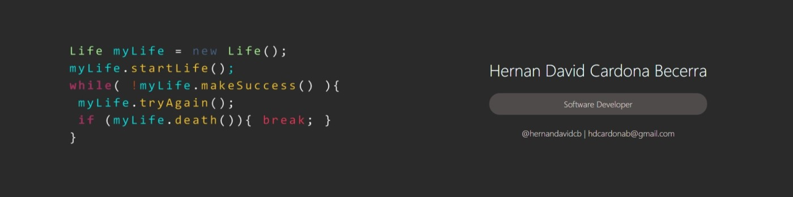

  

---

# 👋 Hi there! I'm Hernán David Cardona | ¡Hola! Soy Hernán David Cardona

  

  
  
  
  
  

---

## 🚀 About Me | Sobre Mí

**English:**
> I'm a passionate Full Stack Developer focused on building modern and scalable web applications. Over the past two years, I've been immersed in learning and developing projects that showcase my skills in both frontend and backend technologies. I love solving problems through code and I'm constantly exploring new technologies to improve my craft.

**Español:**
> Soy un desarrollador Full Stack apasionado enfocado en construir aplicaciones web modernas y escalables. Durante los últimos dos años, he estado inmerso en el aprendizaje y desarrollo de proyectos que demuestran mis habilidades tanto en tecnologías frontend como backend. Me encanta resolver problemas a través del código y constantemente estoy explorando nuevas tecnologías para mejorar mi oficio.

- 🔭 Currently working on | Trabajando actualmente en: **working as freelance by building an e-commerce called "Slicing Edge"**
- 🌱 Learning | Aprendiendo: **Software engineering career at Politécnico Grancolombiano University located in Colombia**
- 👯 Looking to collaborate on | Buscando colaborar en: **Open to Remote Full-Stack Opportunities in the U.S. & Canada**
- 💬 Ask me about | Pregúntame sobre: **Typescript, React, Node.js, Python, Java, software architecture, SOLID principles, Spec-driven development**
- 📍 Location | Ubicación: **Girón, Santander, Colombia**
- ⚡ Fun fact | Dato curioso: **I love to learning continuously about brand new ways to work better and efficiently!**

---

## 🛠️ Tech Stack | Stack Tecnológico

### 🎨 Frontend

### ⚙️ Backend

### 🗄️ Databases | Bases de Datos

### ☁️ Cloud & DevOps

### 🔧 Tools | Herramientas

---

## 🌟 Featured Projects | Proyectos Destacados

### 🍣 [Sushi Burrito JS](https://github.com/hervid2/sushiBurritoJS)
**English:** A complete web application for a Sushi Burrito restaurant built with modern JavaScript technologies. Features include menu management, order processing, and responsive design for an optimal user experience.

**Español:** Aplicación web completa para restaurante Sushi Burrito construida con tecnologías JavaScript modernas. Incluye gestión de menú, procesamiento de pedidos y diseño responsivo para una experiencia de usuario óptima.

---

### ☕ [Sushi Burrito Java](https://github.com/hervid2/sushiBurritoJava)
**English:** Java-based restaurant management system implementing robust backend architecture with enterprise-level patterns. Demonstrates proficiency in Java, object-oriented design, and scalable application development.

**Español:** Sistema de gestión de restaurante basado en Java implementando arquitectura backend robusta con patrones de nivel empresarial. Demuestra dominio en Java, diseño orientado a objetos y desarrollo de aplicaciones escalables.

---

### 🚀 [Portfolio Website](https://portfolio-hernan-cardona.vercel.app/)
**English:** Personal portfolio showcasing my projects, skills, and journey as a Full Stack Developer. Built with React, Nodejs, Typescript, tailwind,  managed by a MySQL database.

**Español:** Portafolio personal que muestra mis proyectos, habilidades y trayectoria como desarrollador Full Stack. Construido con React, Nodejs, Typescript, Tailwind, manejado por una base de datos MySQL.

---

## 🎯 Current Focus | Enfoque Actual

**English:**
- 🤖 Integrating AI into development workflows
- 🏗️ Studying software engineering at the Politecnico Grancolombiano university located in Colombia
- 🍃 Mastering AI to better build and deploy web applications.
- 📚 Building an e-commerce called "Slicing-edge"
- 🌐 Contributing to open source projects

**Español:**
- 🤖 Integrando IA en flujos de trabajo de desarrollo
- 🏗️ Estudiando ingeniería de software en la universidad Politecnico Grancolombiano ubicada en Colombia
- 🍃 Dominando IA para construir y desplegar mejores aplicaciones web.
- 📚 Construyendo un comercio electrónico llamado "Slicing-edge"
- 🌐 Contribuyendo a proyectos de código abierto

---

## 💡 What I Bring | Lo Que Aporto

**English:**
✨ **Problem Solver**: I approach challenges with creative and efficient solutions  
🎨 **Attention to Detail**: Clean code and polished user interfaces are my priority  
📖 **Fast Learner**: Continuously adapting to new technologies and best practices  
🤝 **Team Player**: Open to feedback and eager to collaborate on exciting projects  
🚀 **Self-Motivated**: I've spent the last two and a half years training as a full stack developer and building real-world projects

**Español:**
✨ **Solucionador de Problemas**: Abordo los desafíos con soluciones creativas y eficientes  
🎨 **Atención al Detalle**: El código limpio y las interfaces pulidas son mi prioridad  
📖 **Aprendizaje Rápido**: Adaptándome continuamente a nuevas tecnologías y mejores prácticas  
🤝 **Trabajo en Equipo**: Abierto a retroalimentación y ansioso por colaborar en proyectos emocionantes  
🚀 **Auto-Motivado**: Me dediqué los dos últimos años y medio a la formación como desarrollador full stack y a construir proyectos del mundo real

---

## 🤝 Let's Connect | Conectemos

  
**English:** Open to Remote Full-Stack Opportunities in the U.S. & Canada. Let’s build scalable, high-quality software together. Feel free to reach out, and I’ll respond as soon as possible!

**Español:** Abierto a oportunidades remotas como Full-Stack Developer en Estados Unidos y Canadá. Construyamos juntos software escalable y de alta calidad. ¡Envíame un mensaje y te responderé pronto!

---

  ### ⭐ From [hervid2](https://github.com/hervid2)
  
  **"Code is like humor. When you have to explain it, it's bad." – Cory House**
  
  **Thanks for visiting! | ¡Gracias por visitar!** 💙

